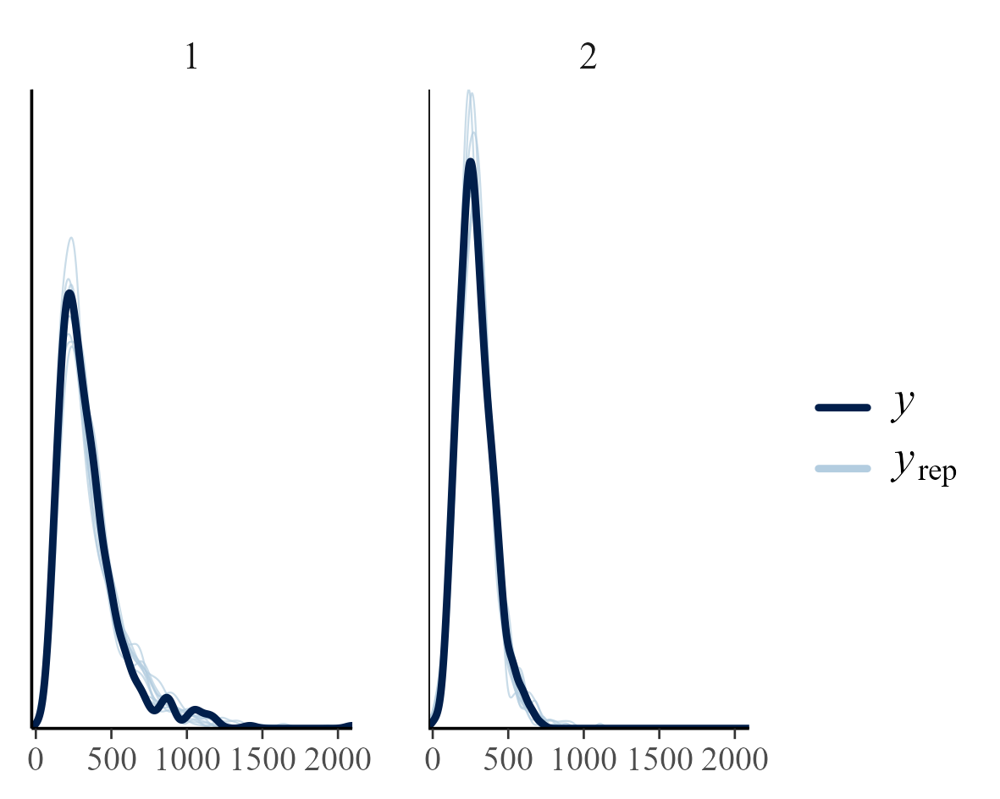

README
================

# Installation

You can install the `{brms.exgaussian}` from GitHub:

``` r
remotes::install_github("mattansb/brms.exgaussian")
```

(You will need to specify the **full path** to the files. E.g.,
`C:\\User\\Cool R Code\\brms.exgaussian_0.0.2.zip`.)

# Demo

This README demos `{brms.exgaussian}` with parameter recovery.

``` r
library(brms)
library(brms.exgaussian)
```

## Generate Data

Using `retimes::rexgauss()` with standard Ex-Gauss parameterization.
(Also available as `brms.exgaussian::rexgaussian2()`.)

``` r
truth <- data.frame(
  Group = 1:2,
  mu = c(150, 180),
  sigma = c(50, 70),
  tau = c(200, 100)
)

g <- sample(1:2, size = 1000, replace = TRUE)

d <- data.frame(
  Group = factor(g),
  rt = retimes::rexgauss(1000,
    mu = truth$mu[g],
    sigma = truth$sigma[g],
    tau = truth$tau[g]
  )
)
```

## Fit `brms` Model

Functions from `{brms.exgaussian}` for standard Ex-Gaussian
distribution.

``` r
exg_stanvars <- exgaussian2_stancode()
exg_family <- exgaussian2()
```

Fit the model:

``` r
fit <- brm(
  bf(
    rt ~ Group,
    tau ~ Group,
    sigma ~ Group
  ),
  data = d,
  
  # brms.exgaussian additions
  family = exg_family,
  stanvars = exg_stanvars
)
```

## Support Via Internal Functions

These all work…

``` r
loo(fit)
waic(fit)
bridgesampling::bridge_sampler(fit)

posterior_epred(fit)

posterior_predict(fit)
```

## Parameter Recovery

### PP-Check

``` r
pp_check(fit, group = "Group", type = "dens_overlay_grouped")
```



### Actual Parameters

Recovered with `{brms.exgaussian}`:

``` r
nd <- data.frame(Group = factor(1:2))

mu <- posterior_linpred(fit,
  newdata = nd,
  dpar = "mu", transform = TRUE
)

sigma <- posterior_linpred(fit,
  newdata = nd,
  dpar = "sigma", transform = TRUE
)

tau <- posterior_linpred(fit,
  newdata = nd,
  dpar = "tau", transform = TRUE
)


nd$mu <- apply(mu, 2, mean)
nd$sigma <- apply(sigma, 2, mean)
nd$tau <- apply(tau, 2, mean)

nd
#>   Group       mu    sigma       tau
#> 1     1 144.0746 43.65374 207.68073
#> 2     2 193.6895 73.64891  92.83953
```

Recovered with `{retimes}`:

``` r
cbind.data.frame(
  Group = 1:2, 
  by(d$rt, d$Group, retimes::timefit) |> 
    lapply(function(p) as.data.frame(as.list(p@par))) |> 
    do.call(what = "rbind")
)
#>   Group       mu    sigma       tau
#> 1     1 144.0544 43.29852 207.28435
#> 2     2 192.9664 72.99485  93.22048
```

Ground truth:

``` r
truth
#>   Group  mu sigma tau
#> 1     1 150    50 200
#> 2     2 180    70 100
```
